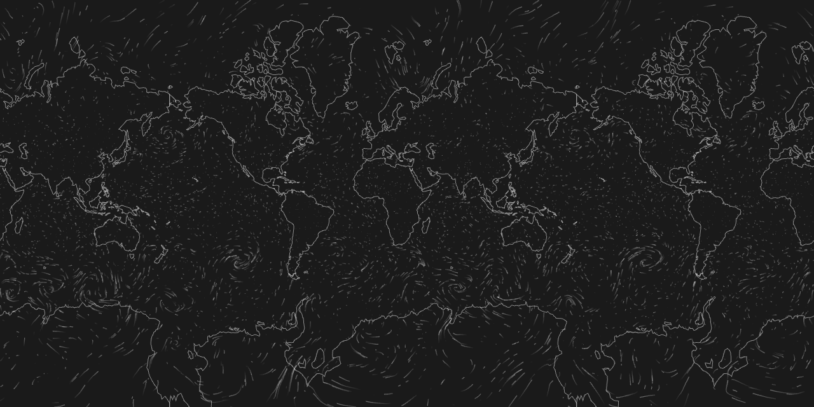

# deck.gl-particle

[](https://www.npmjs.com/package/deck.gl-particle)
[](https://www.npmjs.com/package/deck.gl-particle)
[](https://www.npmjs.com/package/deck.gl-particle)

Particle simulation layer for deck.gl

[Demo](https://weatherlayers.github.io/deck.gl-particle/)



## Usage

```
import { Deck } from '@deck.gl/core';
import { ParticleLayer } from 'deck.gl-particle';

const deckgl = new Deck({
  layers: [
    new ParticleLayer({
      id: 'particle',
      image: ..., // see deck.gl BitmapLayer image property
      imageUnscale: ..., // [number, number]
      bounds: ..., // [number, number, number, number]
      numParticles: ..., // number
      maxAge: ..., // number
      speedFactor: ..., // number
      color: ..., // [number, number, number]
      width: ..., // number
      opacity: ..., // number
    });
  ],
});
```

Requires WebGL 2 (Chrome, Firefox, Edge, Safari 15).

This means that the layer doesn't work in a WebGL 1 interleaved context (such as Mapbox). Use overlaid context instead. See [deck.gl base maps](https://deck.gl/docs/get-started/using-with-map).

## Data

Image contains particle speeds in [deck.gl COORDINATE_SYSTEM.LNGLAT](https://deck.gl/docs/developer-guide/coordinate-systems#supported-coordinate-systems), u component encoded into R channel, v component encoded into G channel. See [sample image](docs/wind_data.png). The image texture can be generated with the following commands, with u.grib and v.grib files as input:

```
gdalbuildvrt -separate wind_data.vrt u.grib v.grib v.grib
gdal_translate -ot Byte -scale -128 127 0 255 wind_data.vrt wind_data.png
```

Pass the generated image texture, the original data bounds and the geographic bounds to ParticleLayer:

```
  image: 'wind_data.png',
  imageUnscale: [-128, 127],
  bounds: [-180, -90, 180, 90],
```

## Inspired by

- [Nicolas Belmonte: Wind Map](https://medium.com/vis-gl/wind-map-a58575f87fe3)
- [Vladimir Agafonkin: How I built a wind map with WebGL](https://blog.mapbox.com/how-i-built-a-wind-map-with-webgl-b63022b5537f)

## Weather map visualization layers as a service

There is a commercial library with particle layer improvements and additional layers available with [WeatherLayers.com](https://weatherlayers.com/) subscription.
